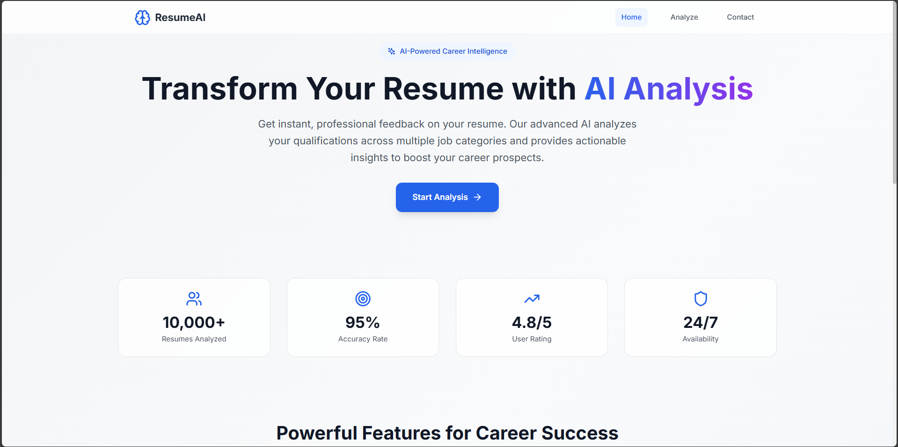
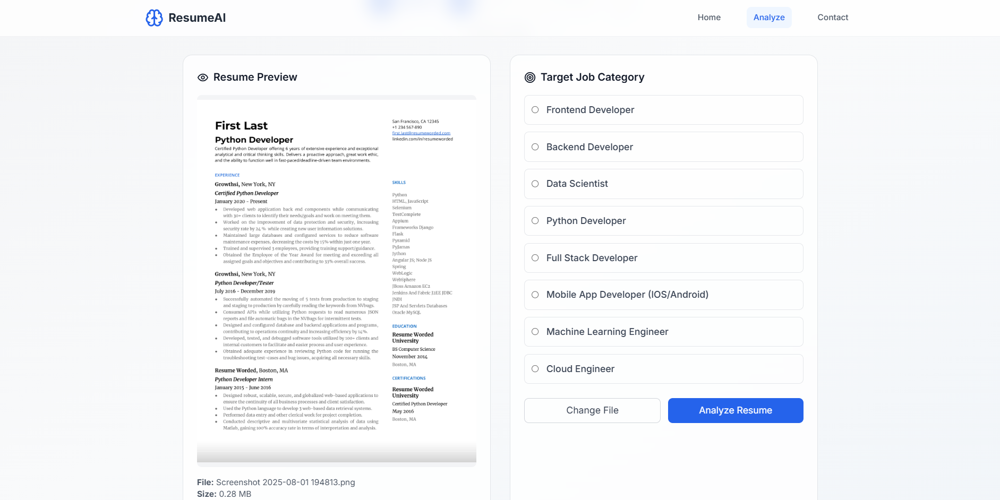
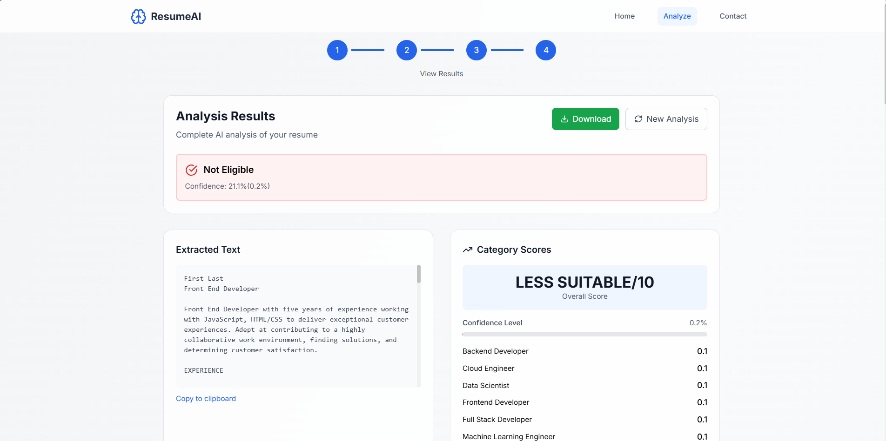

# 🚀 Resume Detector
### *AI-Powered Resume Analysis Platform*

<div align="center">


**🤖 Intelligent • 🎯 Precise • ⚡ Lightning Fast**

*Transform resume analysis with cutting-edge AI technology*

[](https://tensorflow.org)
[](https://reactjs.org)
[](https://flask.palletsprojects.com)
[](https://python.org)

---

*Revolutionizing resume analysis through the power of **Bidirectional RNN** classification and **advanced LLM-powered feedback generation** to deliver comprehensive insights and intelligent extraction capabilities.*

</div>

## 📋 Table of Contents

- [Overview](#overview)
- [Features](#features)
- [Technology Stack](#technology-stack)
- [Architecture](#architecture)
- [Installation](#installation)
- [Usage](#usage)
- [API Endpoints](#api-endpoints)
- [Model Training](#model-training)
- [Screenshots](#screenshots)
- [Contributing](#contributing)
- [License](#license)

## 🌟 Overview

Resume Detector is a cutting-edge AI platform that revolutionizes resume analysis through the power of machine learning and natural language processing. The system employs a sophisticated Bidirectional RNN for resume classification and leverages Groq's advanced LLM capabilities to provide detailed feedback and extraction services.

### Key Highlights

- **🤖 Advanced AI Classification**: Bidirectional RNN model trained on comprehensive datasets
- **🧠 Intelligent Feedback**: LLM-powered detailed analysis and recommendations
- **📄 Smart Extraction**: Automated extraction of key resume information
- **⚡ Real-time Processing**: Fast and efficient resume analysis
- **🎨 Modern UI**: Responsive React-based frontend with Tailwind CSS

## ✨ Features

### Core Functionality
- **Resume Classification**: Automatic categorization using Bidirectional RNN
- **Detailed Analysis**: Comprehensive feedback on resume structure and content
- **Information Extraction**: Automated extraction of:
  - Personal information
  - Skills and competencies
  - Work experience
  - Education details
  - Achievements and certifications
- **Quality Assessment**: AI-driven scoring and improvement suggestions
- **Multiple Format Support**: Support for PDF, DOC, and DOCX files

### Advanced Features
- **LLM Integration**: Groq-powered language model for intelligent insights
- **Feedback Generation**: Detailed recommendations for resume improvement
- **Export Options**: Download analysis reports in various formats
- **Batch Processing**: Handle multiple resumes simultaneously
- **Custom Training**: Ability to retrain models with new datasets

## 🛠️ Technology Stack

### Backend Technologies


### Frontend Technologies


### AI & ML Technologies
- **TensorFlow/Keras**: Deep learning framework for model development
- **Bidirectional RNN**: Advanced neural network architecture
- **Groq LLM**: Large language model for intelligent analysis
- **scikit-learn**: Machine learning utilities and preprocessing
- **NLTK/spaCy**: Natural language processing

### Additional Technologies
- **ESLint**: Code quality and formatting
- **PostCSS**: CSS processing
- **Node.js**: JavaScript runtime environment

## 🏗️ Architecture

```
┌─────────────────┐    ┌─────────────────┐    ┌─────────────────┐
│   React Frontend│    │   Flask API     │    │   ML Models     │
│                 │    │                 │    │                 │
│  - File Upload  │◄──►│  - Routes       │◄──►│  - BiRNN Model  │
│  - Results UI   │    │  - Text Extract │    │  - Groq LLM     │
│  - Feedback     │    │  - Model Pred   │    │  - Tokenizer    │
└─────────────────┘    └─────────────────┘    └─────────────────┘
```

### Project Structure
```
RESUME_DETECTOR/
├── backend/
│   ├── LLM/
│   │   └── __pycache__/
│   ├── Feedback.py          # LLM feedback generation
│   ├── text_extraction.py   # Document text extraction
│   ├── Model/              # Trained models
│   └── routes.py           # API endpoints
├── frontend/
│   ├── src/
│   ├── public/
│   └── Configuration files
├── logs/                   # Application logs
├── Model Training/         # Training scripts and datasets
├── best_model.h5          # Trained BiRNN model
├── final_resume_model...  # Additional model files
└── Configuration files
```

## 🚀 Installation

### Prerequisites
- Python 3.8+
- Node.js 16+
- npm or yarn
- Git

### Backend Setup

1. **Clone the repository**
```bash
git clone https://github.com/yourusername/resume-detector.git
cd resume-detector
```

2. **Set up Python virtual environment**
```bash
python -m venv venv
source venv/bin/activate  # On Windows: venv\Scripts\activate
```

3. **Install Python dependencies**
```bash
pip install -r requirements.txt
```

4. **Set up environment variables**
```bash
cp .env.example .env
# Edit .env with your API keys and configuration
```

5. **Initialize the Flask application**
```bash
cd backend
python routes.py
```

### Frontend Setup

1. **Navigate to frontend directory**
```bash
cd frontend
```

2. **Install dependencies**
```bash
npm install
# or
yarn install
```

3. **Start development server**
```bash
npm run dev
# or
yarn dev
```

### Environment Variables

Create a `.env` file in the root directory:

```env
GROQ_API_KEY=your_groq_api_key_here
FLASK_ENV=development
FLASK_DEBUG=1
MODEL_PATH=./best_model.h5
UPLOAD_FOLDER=./uploads
MAX_CONTENT_LENGTH=16777216
```

## 💻 Usage

### Web Interface

1. **Access the application**
   - Frontend: `http://localhost:3000`
   - Backend API: `http://localhost:5000`

2. **Upload Resume**
   - Click "Upload Resume" button
   - Select PDF, DOC, or DOCX file
   - Wait for processing

3. **View Results**
   - Classification results
   - Detailed feedback
   - Extracted information
   - Improvement suggestions

### API Usage

```python
import requests

# Upload and analyze resume
url = "http://localhost:5000/api/analyze"
files = {'resume': open('resume.pdf', 'rb')}
response = requests.post(url, files=files)
result = response.json()

print(f"Classification: {result['classification']}")
print(f"Score: {result['score']}")
print(f"Feedback: {result['feedback']}")
```

## 📊 API Endpoints

### POST /api/analyze
Analyze uploaded resume file and get comprehensive insights

**Request:**
- Method: POST
- Content-Type: multipart/form-data
- Body: resume file (PDF, DOC, DOCX)

**Response:**
```json
{
  "classification": "Software Engineer",
  "confidence": 0.87,
  "extracted_info": {
    "name": "John Doe",
    "email": "john@example.com",
    "phone": "+1-234-567-8900",
    "skills": ["Python", "React", "Machine Learning", "TensorFlow"],
    "experience": "3 years",
    "education": "Bachelor's in Computer Science",
    "certifications": ["AWS Certified", "Google Cloud Professional"]
  },
  "feedback": {
    "strengths": [
      "Strong technical skills alignment",
      "Clear and professional formatting",
      "Relevant work experience"
    ],
    "improvements": [
      "Add quantifiable achievements with metrics",
      "Include more industry certifications",
      "Expand on leadership experience"
    ],
    "detailed_analysis": "Your resume demonstrates solid technical expertise...",
    "overall_score": 8.2,
    "category_scores": {
      "technical_skills": 9.1,
      "experience": 7.8,
      "formatting": 8.5,
      "achievements": 6.9
    }
  }
}
```

## 🧠 Model Training

### Bidirectional RNN Architecture

The core classification model uses a sophisticated Bidirectional RNN architecture:

```python
model = Sequential([
    Embedding(vocab_size, embedding_dim, input_length=max_length),
    Bidirectional(LSTM(64, return_sequences=True)),
    Bidirectional(LSTM(32)),
    Dropout(0.5),
    Dense(128, activation='relu'),
    Dropout(0.3),
    Dense(num_classes, activation='softmax')
])
```

### Training Process

1. **Data Preparation**
```bash
cd "Model Training"
python prepare_data.py
```

2. **Model Training**
```bash
python train_model.py --epochs 50 --batch_size 32
```

3. **Model Evaluation**
```bash
python evaluate_model.py --test_data ./test_dataset.csv
```

### Dataset Requirements

- **Format**: CSV with columns: `text`, `label`
- **Size**: Minimum 1000 samples per class
- **Balance**: Ensure balanced class distribution
- **Preprocessing**: Text cleaning and tokenization applied automatically

## 📸 Screenshots

### Main Dashboard

*Modern and intuitive dashboard for resume analysis*

### Analysis Results

*Comprehensive analysis results with detailed feedback*

### Feedback Interface

*AI-powered feedback and improvement suggestions*


## 🔧 Configuration

### Model Configuration
```python
# model_config.py
MODEL_CONFIG = {
    'max_sequence_length': 500,
    'embedding_dim': 100,
    'lstm_units': [64, 32],
    'dropout_rate': 0.3,
    'learning_rate': 0.001
}
```

### API Configuration
```python
# config.py
class Config:
    SECRET_KEY = os.environ.get('SECRET_KEY')
    MAX_CONTENT_LENGTH = 16 * 1024 * 1024  # 16MB max file size
    UPLOAD_FOLDER = 'uploads'
    ALLOWED_EXTENSIONS = {'pdf', 'doc', 'docx'}
```

## 🤝 Contributing

We welcome contributions! Please follow these steps:

1. **Fork the repository**
2. **Create a feature branch**
```bash
git checkout -b feature/amazing-feature
```

3. **Make your changes**
4. **Add tests**
5. **Commit your changes**
```bash
git commit -m 'Add amazing feature'
```

6. **Push to the branch**
```bash
git push origin feature/amazing-feature
```

7. **Open a Pull Request**

### Development Guidelines

- Follow PEP 8 for Python code
- Use ESLint configuration for JavaScript/TypeScript
- Write comprehensive tests
- Update documentation for new features
- Ensure backward compatibility

## 📝 License

This project is licensed under the MIT License - see the [LICENSE](LICENSE) file for details.

## 🙏 Acknowledgments

- **TensorFlow Team** for the amazing deep learning framework
- **Groq** for providing advanced LLM capabilities
- **React Community** for the robust frontend framework
- **Open Source Contributors** who make projects like this possible

## 📞 Support

- **Issues**: [GitHub Issues](https://github.com/yourusername/resume-detector/issues)
- **Discussions**: [GitHub Discussions](https://github.com/yourusername/resume-detector/discussions)
- **Email**: support@resumedetector.com

---

<p align="center">
  Made with ❤️ by [Your Name]
</p>

<p align="center">
  <a href="#top">Back to top</a>
</p>
